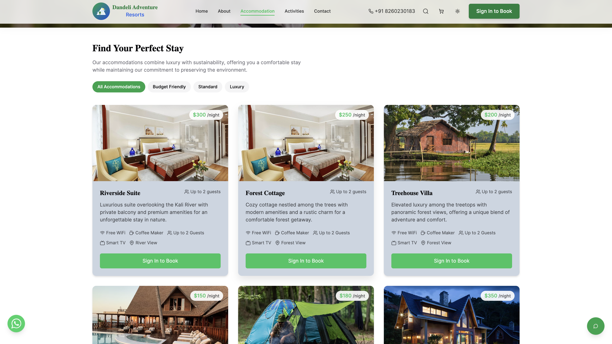
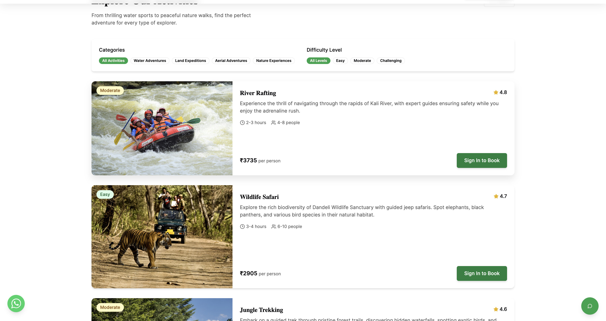

# 🏞️ Dandeli Resort Hub - Adventure Booking Platform

A comprehensive e-commerce booking platform for adventure tourism and resort accommodation in Dandeli, Karnataka. Built with modern web technologies to provide seamless booking experiences for customers and efficient management for resort operators.


## 📋 Table of Contents

- [Overview](#overview)
- [Features](#features)
- [Tech Stack](#tech-stack)
- [Prerequisites](#prerequisites)
- [Installation](#installation)
- [Environment Setup](#environment-setup)
- [Usage](#usage)
- [Project Structure](#project-structure)
- [API Integration](#api-integration)
- [Screenshots](#screenshots)
- [Contributing](#contributing)
- [License](#license)
- [Contact](#contact)

## 🎯 Overview

Dandeli Resort Hub is a full-stack web application that allows users to:
- Browse and book accommodation (rooms, treehouses, cottages)
- Book adventure activities (river rafting, wildlife safaris, trekking)
- Make secure payments via UPI and QR codes
- Manage bookings with modification capabilities
- Contact support via WhatsApp and Email integration

## ✨ Features

### 🔐 Authentication & User Management
- **Clerk Authentication** - Secure login/signup with social media integration
- **Smart Routing** - Automatic redirect handling for authentication flows
- **User Dashboard** - Personalized booking history and management

### 🛒 E-commerce Functionality
- **Shopping Cart** - Add/remove items with persistent storage
- **Real-time Pricing** - Dynamic price calculation with taxes
- **Booking Modification** - Edit existing bookings seamlessly
- **Receipt Generation** - Downloadable booking confirmations

### 💳 Payment Integration
- **UPI Payments** - Direct UPI ID transfer (8260230183@ibl)
- **QR Code Scanner** - Real QR code image for quick payments
- **Payment Confirmation** - Automated email notifications

### 📱 Communication & Support
- **WhatsApp Integration** - Pre-filled support messages
- **Email Support** - Automated booking confirmations
- **Contact Forms** - Multiple communication channels

### 🎨 Modern UI/UX
- **Responsive Design** - Mobile-first approach
- **Dark/Light Mode** - Theme switching capability
- **Animations** - Smooth transitions and micro-interactions
- **Accessibility** - WCAG compliant design

## 🛠️ Tech Stack

### Frontend
- **React 18** - Modern React with hooks and concurrent features
- **TypeScript** - Type-safe development
- **Vite** - Fast build tool and development server
- **Tailwind CSS** - Utility-first CSS framework
- **shadcn/ui** - Beautiful and accessible UI components

### State Management
- **React Context API** - Global state management
- **TanStack Query** - Server state management
- **localStorage** - Client-side data persistence

### Authentication
- **Clerk** - Complete authentication solution
- **React Router** - Client-side routing with auth protection

### Build Tools
- **ESLint** - Code linting and formatting
- **PostCSS** - CSS processing
- **TypeScript Compiler** - Type checking

## 📋 Prerequisites

Before running this project, make sure you have the following installed:

- **Node.js** (v18.0.0 or higher)
- **npm** (v8.0.0 or higher) or **yarn**
- **Git** for version control

Check your versions:
```bash
node --version
npm --version
git --version
```

## 🚀 Installation

### 1. Clone the Repository
```bash
git clone https://github.com/your-username/dandeli-resort-hub.git
cd dandeli-resort-hub
```

### 2. Install Dependencies
```bash
npm install
# or
yarn install
```

### 3. Environment Configuration
Create a `.env.local` file in the root directory:
```env
# Clerk Authentication
VITE_CLERK_PUBLISHABLE_KEY=your_clerk_publishable_key

# API Configuration
VITE_API_BASE_URL=http://localhost:3000

# Payment Configuration
VITE_UPI_ID=8260230183@ibl
VITE_WHATSAPP_NUMBER=918260230183

# Email Configuration
VITE_SUPPORT_EMAIL=pradhanadarsh727@gmail.com
```

### 4. Start Development Server
```bash
npm run dev
# or
yarn dev
```

The application will be available at `http://localhost:8081`

## 🔧 Environment Setup

### Clerk Authentication Setup

1. **Create Clerk Account**: Sign up at [clerk.com](https://clerk.com)
2. **Create Application**: Set up a new application
3. **Get API Keys**: Copy your publishable key
4. **Configure Social Logins**: Enable Google, Facebook, etc.
5. **Set Redirect URLs**: Add your domain URLs

### Email Service Configuration

1. **SMTP Setup**: Configure email service (SendGrid, Mailgun, etc.)
2. **Templates**: Set up email templates for bookings
3. **Webhooks**: Configure booking confirmation webhooks

## 📖 Usage

### For Customers

1. **Browse Catalog**: View rooms and activities
2. **Add to Cart**: Select items with dates and quantities
3. **Secure Checkout**: Complete payment via UPI/QR
4. **Manage Bookings**: View, modify, or contact support
5. **Download Receipts**: Get confirmation documents

### For Administrators

1. **Booking Management**: View all customer bookings
2. **Email Notifications**: Receive booking alerts
3. **Customer Support**: Handle WhatsApp and email inquiries

## 📁 Project Structure

```
dandeli-resort-hub/
├── public/                  # Static assets
│   ├── assets/             # Images and media
│   └── lovable-uploads/    # User uploaded content
├── src/
│   ├── components/         # Reusable UI components
│   │   ├── ui/            # shadcn/ui components
│   │   ├── Footer.tsx     # Site footer
│   │   ├── Navbar.tsx     # Navigation header
│   │   └── ...
│   ├── contexts/          # React Context providers
│   │   ├── CartContext.tsx
│   │   └── ModifyBookingContext.tsx
│   ├── hooks/             # Custom React hooks
│   ├── lib/               # Utility libraries
│   ├── pages/             # Page components
│   │   ├── Home.tsx
│   │   ├── Login.tsx
│   │   ├── MyBookings.tsx
│   │   ├── Payment.tsx
│   │   └── ...
│   ├── utils/             # Helper functions
│   │   └── email-service.ts
│   ├── App.tsx            # Main application component
│   └── main.tsx           # Application entry point
├── docs/                   # Documentation
│   └── screenshots/        # Application screenshots
├── .env.local             # Environment variables
├── package.json           # Dependencies and scripts
├── tailwind.config.ts     # Tailwind CSS configuration
├── tsconfig.json          # TypeScript configuration
└── vite.config.ts         # Vite configuration
```

## 🔌 API Integration

### Booking Flow
```typescript
// Example booking submission
const bookingData = {
  userEmail: user.emailAddresses[0].emailAddress,
  items: cartItems,
  paymentMethod: 'UPI',
  transactionId: 'TXN123456789',
  total: calculateTotal(cartItems)
};

// Send to backend
await submitBooking(bookingData);
```

### Email Notifications
```typescript
// Automated email sending
await sendEmail({
  to: "pradhanadarsh727@gmail.com",
  subject: `New Booking: ${bookingData.name}`,
  body: formatBookingEmail(bookingData)
});
```

## 📸 Screenshots

### Homepage

*Modern landing page with hero section and beautiful camping theme*

### Accommodation Catalog

*Browse available rooms and accommodations with transparent pricing*

### Activity Booking

*Adventure activity selection with ratings and detailed information*

## 🧪 Testing

### Run Tests
```bash
npm run test
# or
yarn test
```

### Build for Production
```bash
npm run build
# or
yarn build
```

### Preview Production Build
```bash
npm run preview
# or
yarn preview
```

## 📦 Deployment

### Vercel Deployment
```bash
# Install Vercel CLI
npm i -g vercel

# Deploy
vercel --prod
```

### Netlify Deployment
```bash
# Build the project
npm run build

# Deploy dist folder to Netlify
```

## 🤝 Contributing

1. Fork the repository
2. Create a feature branch (`git checkout -b feature/amazing-feature`)
3. Commit your changes (`git commit -m 'Add amazing feature'`)
4. Push to the branch (`git push origin feature/amazing-feature`)
5. Open a Pull Request

## 📄 License

This project is licensed under the MIT License - see the [LICENSE](LICENSE) file for details.

## 📞 Contact

**Adarsh Pradhan**
- Email: pradhanadarsh727@gmail.com
- Phone: +91 8260230183
- WhatsApp: [Chat on WhatsApp](https://wa.me/918260230183)

**Project Repository**
- GitHub: [https://github.com/your-username/dandeli-resort-hub](https://github.com/your-username/dandeli-resort-hub)

---

## 🎯 Development Notes

### Key Features Implemented:
- ✅ Complete booking system with cart management
- ✅ Payment integration with UPI and QR codes
- ✅ Booking modification workflow
- ✅ WhatsApp and Email support integration
- ✅ Responsive design with modern UI/UX
- ✅ Authentication with Clerk
- ✅ Real-time booking management

### Performance Optimizations:
- **Code Splitting**: Dynamic imports for route-based code splitting
- **Image Optimization**: Lazy loading and WebP format support
- **Caching**: localStorage for cart and booking persistence
- **Bundle Size**: Optimized build with tree shaking

### Security Features:
- **Authentication**: Secure user authentication with Clerk
- **Input Validation**: Form validation and sanitization
- **Environment Variables**: Secure API key management
- **HTTPS**: Secure data transmission

---

Built with ❤️ for adventure tourism in Dandeli, Karnataka
- Edit files directly within the Codespace and commit and push your changes once you're done.

## What technologies are used for this project?

This project is built with .

- Vite
- TypeScript
- React
- shadcn-ui
- Tailwind CSS

## How can I deploy this project?

Simply open [Lovable](https://lovable.dev/projects/15d22a8d-159c-4e5f-955c-69d700cd8ccd) and click on Share -> Publish.

## I want to use a custom domain - is that possible?

We don't support custom domains (yet). If you want to deploy your project under your own domain then we recommend using Netlify. Visit our docs for more details: [Custom domains](https://docs.lovable.dev/tips-tricks/custom-domain/)
